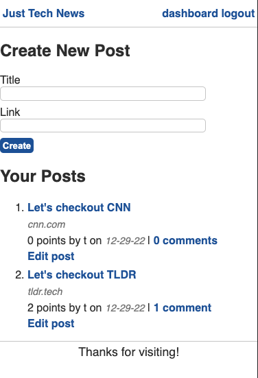

# JAVA - Create tech blog
[](https://opensource.org/licenses/MIT)

## Index

1. [Description](#description)
2. [Installation](#installation)
3. [Usage](#usage)
4. [Features](#features)
5. [Technology](#technology)
6. [Contributing](#contributing)
7. [Resources](#resources)
8. [License](#license)

## Description

```
This app allowed me to develop my first full stack Java app.

As a user, I want to be able to post, comment and like tech blog information.

```

## Installation

Setup:
- (1) Fork the repo, (2) Clone the forked repo locally, (3) Open and run in IntelliJ IDEA.

## Usage

This app is a deployed using Heroku pages. From a development perspective, this app uses Node.js and React. See the technology list below for more detail.

## Features

This app includes a variety of API routes (see list below). In addition, the following features exist.

1. Login / logout with session tracking.
2. Create, edit, delete posts.
3. Add comments to a post.
4. Upvote for a post.

## Technology

1. `Java`
2. `Spring Boot` will replace Node.js and Express.js.
3. `Spring Data` JPA will replace Sequelize.js.
4. `Thymeleaf` will replace Handlebars.js. 
5. `Spring Session` will replace Express Session.
6. `JavaScript:` Is use for dynamic button functionality.
7. `Git/Github:` Repo and version management.
8. `Heroku Pages:` Deployment. Heroku use ClearDB MySQL for the database.

---

## App Screenshot



## Tests

No tests at this time.

## Contributing

Contributor Covenant Code of Conduct

[](https://www.contributor-covenant.org/version/2/1/code_of_conduct/code_of_conduct.md)

## Resources

1. Project Manager: [Steve Calla - GitHub Profile](https://github.com/stevecalla)
2. Deployed Site URL - Heroku: [LINK](https://cc-java-api-calla.herokuapp.com/)
3. GitHub Repo: [LINK](https://github.com/stevecalla/tech-news-java-api)
4. Contact: [Email Steve](mailto:callasteven@gmail.com)

## License

[](https://opensource.org/licenses/MIT)
This project is licensed under the terms of the <span style="color:red">The MIT License</span>. Please click on the license badge for more information.
